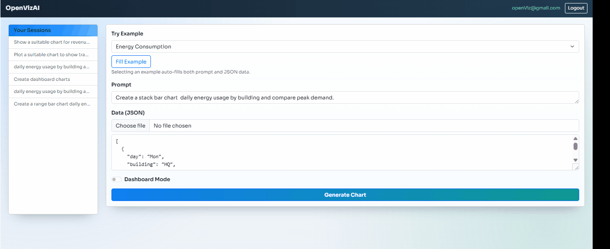

<div align="center">

# OpenVizAI

### Turn any dataset into the right chart — intelligently, instantly.

The missing intelligence layer between your data pipeline and your visualization.

Prompt in. Chart out. Under 3,000 tokens. Every time.

[](https://opensource.org/licenses/MIT)
[](CONTRIBUTING.md)

</div>

---

## The Problem

Every "AI + data" tool makes the same mistake: they treat the LLM like a database.

Send 1,000 rows of JSON to a model and ask it to generate chart data? You get:

- **Context window overflow** on large datasets
- **High token cost** — paying for data transformation the LLM shouldn't be doing
- **Hallucinated structures** — invented fields, wrong aggregations
- **Slow responses** — seconds of latency for work that deterministic code handles in milliseconds

Most existing solutions follow this path:

```
Dataset → LLM transforms entire dataset → Chart
```

That's expensive, unreliable, and doesn't scale.

---

## The Solution

OpenVizAI takes a fundamentally different approach: **use the LLM for decisions, not data transformation.**

```
Dataset → Sample 2-3 rows → LLM decides chart type + field mapping → JS engine transforms full dataset → Chart
```

The LLM only sees a tiny sample of your data. It decides *what* to visualize (chart type, axes, series, grouping). Then deterministic JavaScript functions called **embedding functions** handle the actual data transformation across the full dataset.

The result: correct charts from any dataset shape, under 3,000 tokens, every time.

---

## Demo

### Single Chart Intelligence

> Prompt: *"Plot a suitable chart for this data"* → OpenVizAI analyzes the schema, picks the optimal chart type, and renders it — zero manual configuration.

<div align="center">

</div>

### Multi-Chart Dashboard

> Prompt: *"Generate a dashboard"* → OpenVizAI creates multiple complementary charts from the same dataset, each showing a different analytical perspective.

<div align="center">

</div>

---

## How It Works

> **Your Data** (any size)
> → **Smart Sampler** (2–3 rows)
> → **LLM** decides chart type, axes, series, labels
> → **Embedding Functions** (JS) transform the full dataset
> → **ApexCharts** renders the final chart

**Key insight:** The LLM never sees your full dataset. It receives a small sample and returns a metadata object called an **embedding** — a declarative description of how to map fields to axes, series, and categories. Deterministic code does the rest.

Example LLM output:

```json
{
  "chart_type": "bar",
  "embedding": {
    "x": [{ "field": "month", "label": "Month" }],
    "y": [{ "field": "revenue", "label": "Revenue" }]
  },
  "meta": {
    "title": "Monthly Revenue",
    "subtitle": "Jan – Dec 2025"
  }
}
```

This metadata is all the rendering layer needs. The embedding functions take this plus the original dataset and produce the final chart — no matter if the dataset has 100 or 500,000 rows.

---

## Token Cost

| Dataset Size | Data Sent to LLM | Avg Tokens | Est. Cost (GPT-4o) |
|---|---|---|---|
| 1K rows | 2-3 sampled rows | ~3,000 | ~$0.0004 |
| 50K rows | 2-3 sampled rows | ~3,000 | ~$0.0004 |
| 500K rows | 2-3 sampled rows | ~3,000 | ~$0.0004 |
| **Any size** | **Sampled** | **< 3,000** | **< $0.005** |

> Token counts include system prompt, data sample, user intent, and full chart config response.
> Sampling is statistically representative — chart quality doesn't degrade at scale.

---

## How OpenVizAI Is Different

Most AI visualization tools follow a pipeline like this:

| | Typical AI Viz Tool | OpenVizAI |
|---|---|---|
| **What LLM does** | Transforms the entire dataset into chart structures | Decides chart type + field mappings only |
| **Data sent to LLM** | Full dataset (or large chunks) | 2-3 sampled rows |
| **Data transformation** | LLM-generated (unreliable at scale) | Deterministic JS functions |
| **Token usage** | Scales with dataset size | Constant (~3K tokens) |
| **Visualization quality** | Data-science style (matplotlib, plotly) | Production dashboard charts (ApexCharts) |
| **Rendering** | Server-side or notebook | Client-side, embeddable React components |

**Compared to tools like Vanna.ai:**

Vanna's pipeline: `User Question → LLM → SQL → Database → Pandas DataFrame → Rule-based visualization`

Their visualization step uses heuristics: *if categorical + numeric → bar chart, if time series → line chart, if percentage → pie chart.* It works for notebooks, but produces data-science-oriented visuals — not interactive, dashboard-grade charts.

**OpenVizAI's pipeline:** `Dataset → LLM decides visualization strategy → JS engine transforms data → ApexCharts renderer`

The LLM doesn't just match patterns — it understands user intent. Ask for *"show me workforce utilization trends"* and it picks a line chart with the right axes. Ask for *"compare departments"* from the same data and it picks a grouped bar chart. Same dataset, different insight, different chart — driven by reasoning, not rules.

---

## Use Cases

### Drop-in visualization for Text-to-SQL

Your SQL pipeline returns a JSON result set. You don't know the schema ahead of time. Pass it to OpenVizAI with the original user prompt — get back a fully configured chart.

```
Text-to-SQL → Query result (JSON) → OpenVizAI → Interactive chart
```

### AI-powered dashboards

Feed a dataset and let OpenVizAI generate a multi-chart dashboard. Each chart covers a different analytical dimension of the same data — trends, comparisons, distributions — without any manual configuration.

### Visualization layer for analytics platforms

OpenVizAI is designed to be embedded. The core intelligence (`@openvizai/core`) runs server-side to decide chart configurations. The React renderer (`@openvizai/react`) renders them client-side. Wire them into any existing product.

---

## Packages

| Package | Description |
|---|---|
| [`@openvizai/core`](https://www.npmjs.com/package/@openvizai/core) | Chart intelligence engine — analyzes datasets, calls LLM, returns chart metadata |
| [`@openvizai/react`](https://www.npmjs.com/package/@openvizai/react) | React components — renders charts from metadata + dataset using ApexCharts |
| `@openvizai/shared-types` | Shared TypeScript types and constants across packages |

### Quick Install

```bash
# Intelligence layer (server-side)
npm install @openvizai/core

# React renderer (client-side)
npm install @openvizai/react
```

### Basic Usage

**Server-side** — analyze a dataset:

```ts
import { analyzeChart } from "@openvizai/core";

const result = await analyzeChart({
  prompt: "Show revenue trends over time",
  data: myDataset,
  config: { provider: "google-genai", apiKey: process.env.GEMINI_API_KEY },
});

// result.result → { chart_type, embedding, meta }
```

**Client-side** — render the chart:

```tsx
import { OpenVizRenderer } from "@openvizai/react";

<OpenVizRenderer
  data={dataset}
  chartType={result.chart_type}
  embedding={result.embedding}
  meta={result.meta}
/>
```

---

## Playground Demo

The repo includes a full-stack playground application so you can try OpenVizAI immediately.

**See the [Playground Setup Guide](docs/PLAYGROUND.md) for step-by-step instructions.**

Quick summary:

```bash
git clone https://github.com/jaygajera17/OpenVizAI.git
cd OpenVizAI
npm install
# Configure .env (Gemini API key + PostgreSQL)
npx prisma db push
npm run dev
```

The playground features built-in example datasets so you can start generating charts immediately — no data preparation needed.

---

## Roadmap

### Near-Term
- [ ] Full ApexCharts chart type coverage (heatmap, scatter, candlestick, treemap, etc.)
- [ ] Improved sampling strategies for highly skewed and sparse datasets

### Mid-Term
- [ ] **VizEngine abstraction** — pluggable renderer interface to target Chart.js, Recharts, or D3 from the same config
- [ ] **Data insights** — surface trends, anomalies, and statistical summaries from datasets without additional LLM calls
- [ ] **Multi-LLM support** — OpenAI, Anthropic Claude, Gemini, and local models

### Future
- [ ] **Prompt-driven theming** — *"Use our brand colors"* or *"dark mode"* applied via natural language
- [ ] **Config export** — export generated chart configs as reusable JSON or component code

---

## Contributing

Contributions are welcome.

### Quick Start

1. Fork the repository
2. `git clone https://github.com/YOUR_USERNAME/OpenVizAI.git`
3. `git checkout -b feature/your-feature-name`
4. Make focused changes with clear commits
5. Open a Pull Request against `main`

### Good First Issues

| Area | What's Needed |
|---|---|
| New Chart Types | Expand ApexCharts coverage 
| Examples | Real-world integration examples (Next.js, Text-to-SQL, etc.) |
| Documentation | Improve API docs and usage guides |

### Reporting Bugs

[Open an issue](https://github.com/jaygajera17/OpenVizAI/issues) with a clear description, steps to reproduce, and sample data + prompt if relevant.

---

## License

[MIT](LICENSE)

---

<div align="center">

**If OpenVizAI fills a gap in your stack, star the repo — it helps others find it.**

*Built for developers who are done hardcoding chart types.*

</div>