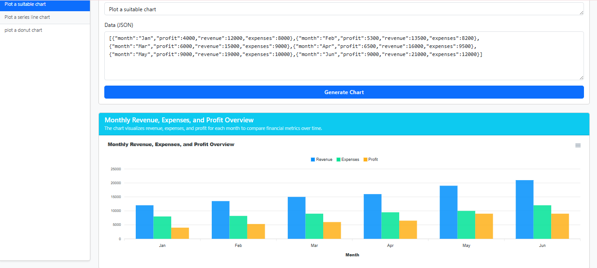

<div align="center">

# 🧠 OpenVizAI
### *Turn any data into the right chart — intelligently, instantly.*

**The missing intelligence layer between your data pipeline and your visualization.**
Prompt in. Beautiful chart out. Under 3,000 tokens. Every time.

[](https://opensource.org/licenses/MIT)
[](CONTRIBUTING.md)
[](https://apexcharts.com/)
[]()

</div>

---

## ✨ The Problem It Solves

You're building a **Text-to-SQL tool**. Or a data dashboard. Or an analytics pipeline.

You've solved the hard part — the query runs, the data comes back. But now you're stuck:

> *"The user's prompt could be anything. The result schema could be anything. How do I know which chart to render — and how to configure it correctly?"*

You could hardcode logic. You could ask users to pick a chart type. Or you could just let **OpenVizAI** figure it out.

Pass in your data + a prompt. Get back a fully configured, rendered chart. No assumptions. No manual mapping. No wasted tokens.

---

## 🎯 Who Is This For

**OpenVizAI is the go-to connector for:**

- 🏗️ **Text-to-SQL builders** — Your pipeline produces result sets. OpenVizAI turns them into the right visualization, automatically.
- 📊 **Dashboard & BI developers** — Stop hardcoding chart types. Let the AI infer the best visual for any dataset shape.
- 🔬 **Data app developers** — Users upload unknown data? OpenVizAI handles the visualization intelligence so you don't have to.
- 🤖 **AI application builders** — Add a powerful, prompt-driven charting layer to any LLM-powered product.

> **OpenVizAI is not a "chat with your data" tool.** It's a focused, single-purpose engine: *given data and intent, produce the correct chart.* That constraint is what makes it fast, cheap, and embeddable.

---

## 🚀 Core Capabilities

- **🤖 LLM-Powered Chart Intelligence** — Understands your data structure and user intent to select and configure the right chart automatically
- **📊 Supported Chart Types** *(via ApexCharts)*
  - Bar Chart
  - Line Chart
  - Area / Series Chart
  - Pie Chart
  - Donut Chart
  - *(Actively expanding — targeting full ApexCharts coverage)*
- **⚡ Minimal Token Usage** — Smart sampling means every generation stays under **3,000 tokens**, regardless of dataset size
- **🕐 Session History** — All past chart generations are saved per session. Pick up any previous result instantly.
- **🔌 Pipeline-Friendly** — Designed to sit as a layer inside existing data workflows, not replace them

---

## 📸 Preview



> *Prompt: "Plot a suitable chart" → OpenVizAI infers a grouped bar chart for Revenue, Expenses & Profit across months — zero manual config.*

---

## 🔢 Performance & Token Cost Matrix

| Dataset Size | Data Sent to LLM | Avg Tokens Used | Estimated Cost (GPT-4o) |
|---|---|---|---|
| 1K rows | Sampled | ~2,800 | ~$0.002 |
| 50K rows | Sampled | ~2,900 | ~$0.003 |
| 500K rows | Sampled | ~3,000 | ~$0.004 |
| **Any size** | Sampled | **< 3,000** | **< $0.005** |

> Token counts include system prompt, data sample, user intent, and full chart config response.
> Costs vary by model and provider. Samples are statistically representative — chart quality doesn't degrade at scale.

---

## 🛠️ Getting Started

```bash
# Clone the repo
git clone https://github.com/jaygajera17/OpenVizAI.git
cd OpenVizAI

# Install dependencies
npm install

# Add your LLM API key
cp .env.example .env
# Edit .env → OPENAI_API_KEY=your_key_here

# Run
npm run dev
```

Open `http://localhost:3000`, paste your JSON data, describe what you want, and hit **Generate Chart**.

---

## 💡 Real-World Use Case

**Scenario:** You're building a Text-to-SQL product. A user types:

> *"Show me monthly revenue vs expenses for Q1"*

Your backend runs the query. The result is a JSON array with unknown column names, mixed numeric types, and a date field. You have no idea what chart to render.

You pass the result + the original user prompt to **OpenVizAI**.

It returns a fully configured ApexCharts grouped bar chart — correct series, correct axes, correct labels. Rendered. Done.

That's the integration point OpenVizAI is built for.

---

## 🗺️ Roadmap

### 🔜 Near-Term
- [ ] Full ApexCharts chart type coverage (heatmap, radar, scatter, candlestick, etc.)
- [ ] REST API / embeddable component for easier pipeline integration
- [ ] Improved sampling strategies for highly skewed datasets

### 🧱 Mid-Term
- [ ] **Library-Level Package** — `npm install openvizai` to drop the intelligence layer into any project
- [ ] **VizEngine Abstraction** — A pluggable renderer interface so OpenVizAI can target ApexCharts, Chart.js, Recharts, or D3 from a single config standard. One prompt. Any chart library.
- [ ] **Multi-LLM Support** — OpenAI, Anthropic Claude, Gemini, and local model support

### 🔮 Future Vision
- [ ] **Client-Side Insight Generation** — Surface trends and anomalies from data *without* sending it to an LLM, using [danfo.js](https://danfo.jsdata.org/) DataFrame operations. Intelligence at zero extra token cost.
- [ ] **Prompt-Driven Theming** — *"Use our brand colors"* or *"dark mode, cyberpunk aesthetic"* — LLM-generated color palettes and chart styles from plain language
- [ ] **Config Export** — Export the generated ApexCharts config as reusable JSON or component code

---

## 🤝 Contributing

OpenVizAI is actively growing and contributions are very welcome!

### How to Contribute

1. **Fork** the repository
2. **Clone** your fork: `git clone https://github.com/YOUR_USERNAME/OpenVizAI.git`
3. **Create a branch**: `git checkout -b feature/your-feature-name`
4. **Make your changes** with clear, focused commits
5. **Push** and open a **Pull Request** against `main`

### Great First Contributions

| Area | What's Needed |
|---|---|
| 📊 New Chart Types | Help expand ApexCharts coverage |
| 🧪 Tests | Unit and integration tests |
| 📖 Docs & Examples | Real-world integration examples |
| 🎨 UI Polish | Cleaner interface and UX improvements |
| ⚙️ VizEngine Design | Architectural input on the multi-library abstraction |

### Guidelines

- One feature or fix per PR — keep it focused
- For large features, **open an issue first** to align before building
- Include a short description of *what* and *why* in your PR
- Follow existing code style and naming conventions

### Reporting Issues

[Open an issue](https://github.com/jaygajera17/OpenVizAI/issues) with:
- Clear title and description
- Steps to reproduce (for bugs)
- Sample data + prompt that triggered the issue (if relevant)

---

## 🧠 The Philosophy

Every "AI + data" tool makes the same mistake: they treat the LLM like a database and dump everything into the context window.

OpenVizAI treats the LLM as what it is — **a reasoning engine**. Your data stays local. The model gets just enough context to understand the shape of your data and the intent of your prompt. Then it hands back a chart configuration. Precise. Cheap. Fast.

This is especially important for pipeline builders: your users don't care how the chart gets made. They just want the right chart, rendered correctly, the first time. That's the only job OpenVizAI has — and it does it well.

---


<div align="center">

**If OpenVizAI fills a gap in your stack, ⭐ the repo — it helps others find it.**

*Built for developers who are done hardcoding chart types.*

</div>